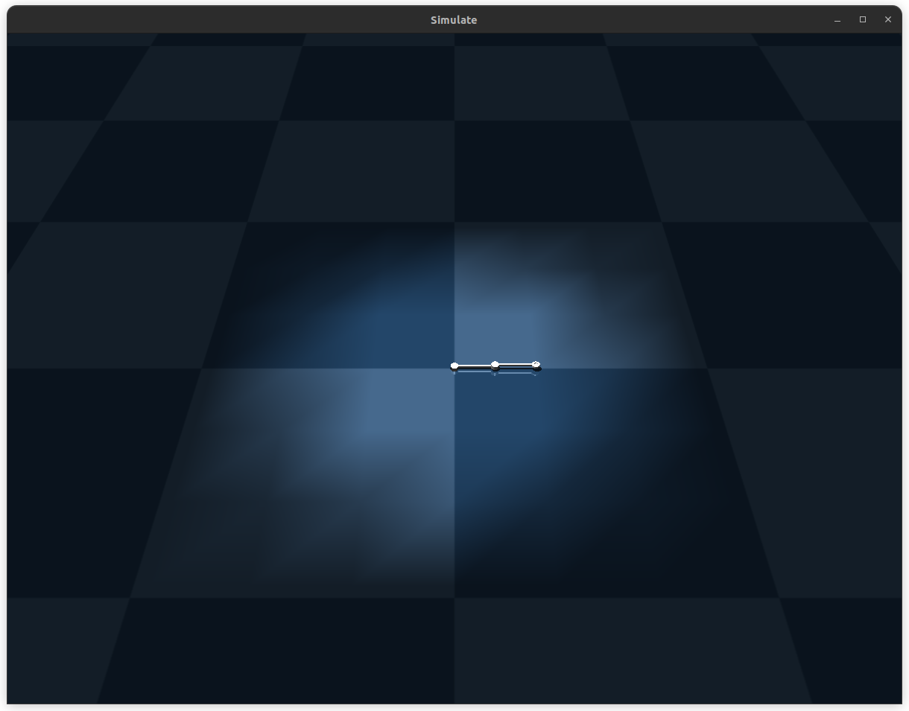

# mujoco_two_link
２次元2リンクモデルをMuJoCoでシミュレーション

# 環境

- Ubuntu 22.04LTS
- MuJoCo 3.2.0

# 実行
```
$ https://github.com/kaitoyamazaki/mujoco_two_link.git
$ cd mujoco_two_link
$ chmod +x make.bash
$ ./make.bash
```

上記コマンド実行後, 以下のようなウィンドウが展開.

